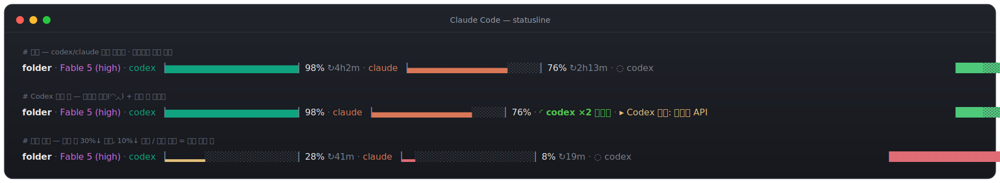

# claude-statusline

Claude Code CLI 하단에 Claude/Codex 사용량, 컨텍스트, Codex 실행 상태를 한 줄로 보여주는 상태줄.



## 기능

- codex / claude 사용량 게이지 (5시간 남은 양 + 주간 사용량 + 리셋 시간)
- Codex 실행 상태 표시 (대기/작업중, 병렬 개수)
- 컨텍스트 게이지
- 진행 중 태스크 표시
- `/refresh`로 사용량 즉시 새로고침

## 설치

```bash
curl -fsSL https://raw.githubusercontent.com/zoo3323/claude-statusline/main/install-claude-statusline.sh | bash
```

`jq`가 없으면 관리자 권한 없이 `~/.local/bin`에 자동 설치됩니다. 설치 후 Claude Code를 재시작하면 적용됩니다.

## 사용법

- 사용량 즉시 새로고침: 터미널 `cu-refresh`, Claude Code 안에서 `/refresh`
- Codex 관련 표시는 Codex MCP 연동이 있을 때만 나타남

## 제거

```bash
curl -fsSL https://raw.githubusercontent.com/zoo3323/claude-statusline/main/uninstall-claude-statusline.sh | bash
```

설치가 건드린 것(상태줄 스크립트, `settings.json`의 statusLine/Codex 훅, `cu-refresh` alias)만 정확히 되돌립니다. 다른 설정은 그대로 둡니다.
