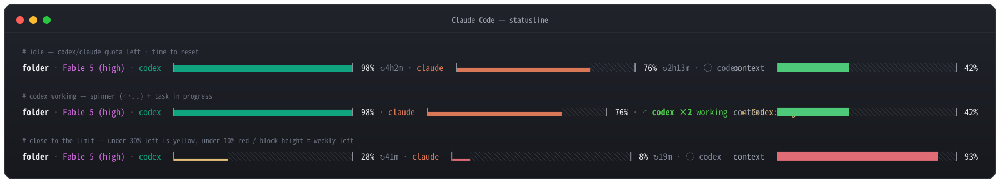

# claude-statusline

**English** · [한국어](README.ko.md)

A one-line status line for Claude Code: Claude and Codex usage, the context
window, Codex run state, and the task in progress.



## Install

```bash
curl -fsSL https://raw.githubusercontent.com/zoo3323/claude-statusline/main/install-claude-statusline.sh | bash
```

Restart Claude Code and the status line appears. `jq` is fetched into
`~/.local/bin` if it is missing, no admin rights required. Everything lands in
`~/.claude/scripts/`, a `/refresh` skill, caches under
`~/.claude/codex-status/`, and a `cu-refresh` link in `~/.local/bin`.

## Reading a usage gauge

| part | meaning |
| --- | --- |
| bar length | share of the 5-hour window still left |
| block height `▁▂▃▄▅▆▇█` | weekly quota still left |
| colour | yellow under 30% left, red under 10% |
| `↻1h23m` | time until the window resets |

Usage keeps moving while you are idle — it is polled in the background, not only
after you prompt. To refresh on the spot: `cu-refresh` in a terminal, `/refresh`
inside Claude Code. The Codex parts only appear when Codex MCP is wired into
Claude Code.

The poll reuses the OAuth tokens Claude Code and Codex already store on this
machine to read your account usage. Those are account-info requests: they
consume no usage, and nothing is sent anywhere else. Neither endpoint is a
documented API, so on any error the gauge falls back to what Claude Code
reports.

## Uninstall

```bash
curl -fsSL https://raw.githubusercontent.com/zoo3323/claude-statusline/main/uninstall-claude-statusline.sh | bash
```

Reverts exactly what the installer touched and leaves everything else alone.

## Development

The scripts live in `src/`. `install-claude-statusline.sh` is generated from them
by `./build.sh` — edit `src/`, not the installer. `./build.sh --check` fails when
the committed installer is out of date.
